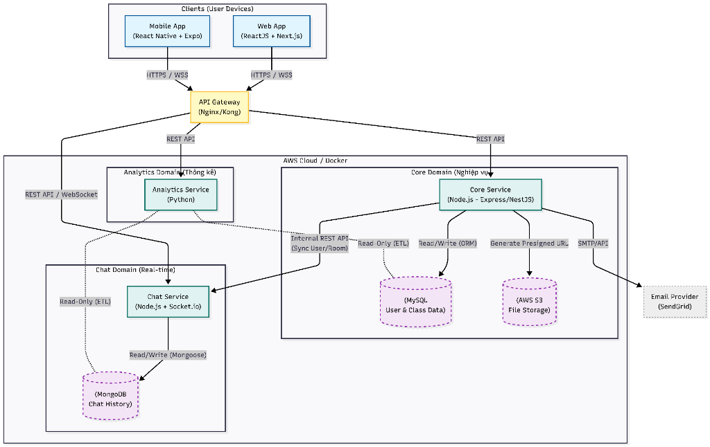

# OTT Education Platform - Graduation Project

Welcome to the **OTT Education Platform**, a comprehensive microservices-based application designed for online education. This project integrates a modern web frontend, a mobile application, robust backend services, and realtime communication capabilities.

## 🚀 Overview

The system is designed to provide a seamless learning experience across devices. It features:

- **Web App**: A responsive student/instructor portal built with [Next.js](https://nextjs.org/).
- **Mobile App**: A cross-platform mobile experience (iOS/Android) built with [React Native (Expo)](https://expo.dev/).
- **Core Service**: The business logic powerhouse built with [Spring Boot](https://spring.io/projects/spring-boot).
- **Chat Service**: Realtime messaging infrastructure using [Node.js](https://nodejs.org/) and [Socket.io](https://socket.io/).
- **Gateway**: An [Nginx](https://nginx.org/) reverse proxy for efficient traffic routing and load balancing.

---

## 🏗 System Architecture

The following diagram illustrates the microservices architecture of the platform:



---

## 📂 Project Structure (Monorepo)

```bash
├── apps/
│   ├── web-app/          # Next.js Frontend
│   └── mobile-app/       # React Native (Expo) Mobile App
├── services/
│   ├── core-service/     # Spring Boot Backend (Business Logic)
│   ├── chat-service/     # Node.js Chat Backend
│   └── analytics-service/# Analytics Service (Planned)
├── gateway/              # Nginx Configuration
├── docker-compose.yml    # Docker orchestration for Backend & Web
├── .env.example          # Environment variables template
└── README.md             # Project Documentation
```

---

## 🤝 Team Workflow & Contribution Guidelines

To ensure code quality and collaboration efficiency for our team of 10 members, we adhere to the strict following guidelines.

### 1. Branching Strategy (Git Flow)

We use a **Feature Branch Workflow**. Direct commits to `main` are **prohibited**.

- **`main`**: Production-ready code. Only merged via Pull Request (PR) after approval.
- **`develop`**: Integration branch for testing.
- **Feature Branches**: Created from `main` or `develop` for specific tasks.
  - Naming Convention: `type/feature-name`
  - Examples:
    - `feat/user-auth`: Adding login functionality.
    - `fix/chat-socket`: Fixing socket connection issues.
    - `docs/update-readme`: Updating documentation.
    - `style/login-page`: UI improvements.

### 2. Commit Convention (Conventional Commits)

All commit messages must follow the [Conventional Commits](https://www.conventionalcommits.org/) specification:

```
<type>: <description>

[optional body]
```

**Types:**

- `feat`: A new feature
- `fix`: A bug fix
- `docs`: Documentation only changes
- `style`: Changes that do not affect the meaning of the code (white-space, formatting, etc)
- `refactor`: A code change that neither fixes a bug nor adds a feature
- `chore`: Changes to the build process or auxiliary tools

**Example:**

> `feat: implement login with google oauth`

### 3. Pull Request (PR) Process

1.  Push your feature branch.
2.  Create a PR to `develop` (or `main` for hotfixes).
3.  **Review Required**: At least 1-2 team members must review and approve the code.
4.  **Checks**: Ensure local tests pass before merging.

---

## 🛠 Prerequisites

Ensure you have the following installed:

- [Docker](https://www.docker.com/get-started) & [Docker Compose](https://docs.docker.com/compose/install/)
- [Node.js](https://nodejs.org/) (LTS version)
- [Java JDK 21+](https://adoptium.net/) (for Core Service development)

---

## ⚙️ Installation & Setup

### 1. Clone the repository

```bash
git clone <repository-url>
cd ott-education
```

### 2. Backend & Web App (Docker)

This starts Core Service, Chat Service, Web App, Databases, and Gateway.

1.  **Configure Environment**:

    ```bash
    cp .env.example .env
    # Check .env and update values if needed
    ```

2.  **Run Services**:
    ```bash
    docker-compose up -d --build
    ```

### 3. Mobile App (Local Development)

The mobile app is **not** in Docker to allow for easier device testing/emulation.

1.  Navigate to the mobile app directory:

    ```bash
    cd apps/mobile-app
    ```

2.  Install dependencies:

    ```bash
    npm install
    ```

3.  Start the Expo server:

    ```bash
    npm start
    ```

    - Scan the QR code with **Expo Go** on your phone (Android/iOS).
    - Or press `a` for Android Emulator / `i` for iOS Simulator.

---

## 🌐 Endpoints & Access

| Component      | URL / Port                        | Description                     |
| :------------- | :-------------------------------- | :------------------------------ |
| **Gateway**    | `https://localhost:8000`          | Unified secure entry point.     |
| **Gateway HTTP (Compat)** | `http://localhost:8088` | HTTP dev compatibility endpoint (useful for mobile/Expo). |
| **Web App**    | `https://localhost:8000`          | Accessible via Gateway.         |
| **Mobile App** | `exp://<your-ip>:8081`            | Access via Expo Go or Emulator. |
| **Core API**   | `http://localhost:8000/api/core/` | Spring Boot Swagger/API.        |
| **Chat API**   | `http://localhost:8000/api/chat/` | Chat Service API.               |
| **Socket.io**  | `ws://localhost:8000`             | Path: `/socket.io/`             |

For LAN video call testing from other laptops, use HTTPS via `https://<LAN-IP>:8000` so browser camera permission is available in secure context.

See [gateway/README.md](gateway/README.md) for complete gateway setup/troubleshooting on any host.
See [gateway/certs/README.md](gateway/certs/README.md) for mkcert setup and trust steps.

---

## 🔐 Gateway JWT Authentication

Gateway now enforces JWT access-token validation for backend APIs using Nginx `auth_request`.

- **Protected routes**:
    - `/api/core/**`
    - `/api/chat/**`
- **Public routes (no JWT required)**:
    - `/api/core/auth/**`
    - `/api/core/schools/**`
    - `/api/core/api/schools/**`

Validation flow:

1. Client sends `Authorization: Bearer <access_token>`.
2. Gateway calls internal auth subrequest to Core Service endpoint `GET /auth/validate`.
3. If token is valid, request is proxied to target service.
4. If token is missing/invalid/expired, gateway returns `401`.

Notes:

- Access token source is **Authorization Bearer header only**.
- In Docker Compose, `core-service` and `chat-service` are no longer published to host ports to reduce gateway bypass risk.
- `/socket.io/` is unchanged in this phase and should be secured separately at handshake level if required.

---

## 🗄️ Database Credentials

Default credentials for local development (defined in `.env`):

- **MySQL**:
  - Host: `localhost` (Port: `3306`)
  - User: `admin` / Password: `admin_password`
  - Database: `ott_education_db`

- **MongoDB**:
  - Host: `localhost` (Port: `27017`)
  - User: `root` / Password: `secret_mongo_pass`
  - Database: `chat_history_db`
